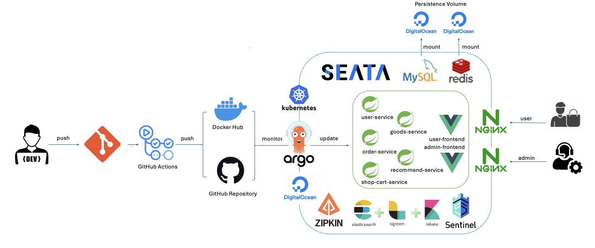

# ShopEase: A Cloud Native Online E-Commerce Solution

## Overview

ShopEase is a robust, cloud-native e-commerce platform built to provide scalable and resilient service using cutting-edge technologies across Docker, Kubernetes, Argo CD, and GitHub Actions. This platform streamlines the e-commerce process through multiple dedicated microservices, each tailored to a specific operational need.

## Architecture

### Cloud-Native Infrastructure

The ShopEase architecture is designed to fully leverage the cloud's capabilities, ensuring flexibility, scalability, and reliability:

- **Containerization with Docker**: Each component of ShopEase, including microservices and frontends, is containerized using Docker, encapsulating dependencies and environments to ensure consistency across development, testing, and production.

- **Kubernetes Orchestration**: We use Kubernetes to manage and scale our containers automatically. It handles load balancing, service discovery, and self-healing (automatic restarts), crucial for handling peak loads and ensuring high availability.

- **State Persistence**: Uses DigitalOcean block storage for persistent data storage needs, mounted as volumes in Kubernetes pods to store and manage data across service restarts and scaling.

### Microservices

- **Decoupled Services**: Each service (User, Goods, Order, Recommend, Shop-Cart) is developed, deployed, and scaled independently. This microservices architecture boosts agility and improves fault isolation.

- **Service Communication**: Services communicate using lightweight REST APIs, and asynchronous messaging through RabbitMQ, enhancing performance and reliability.

### Frontends

- **User and Admin Interfaces**: Separate React applications optimized for performance and usability. Served via Nginx, providing caching and load balancing to enhance user experience.

### DevOps and Automation

- **GitHub Actions for CI/CD**: Automates testing, building, and deploying phases. On git push, GitHub Actions builds Docker images and pushes them to DockerHub.

- **Argo CD for Deployment**: Implements GitOps by automatically syncing and deploying the latest Docker images from DockerHub to the Kubernetes cluster based on the configurations stored in GitHub.

- **Monitoring and Logging**: Integrated with ELK stack for logging and Prometheus with Grafana for real-time monitoring and alerting.

## Technologies

- **Docker and Kubernetes**: Core to the containerization and orchestration.
- **GitHub Actions and Argo CD**: For seamless CI/CD.
- **MySQL and Redis**: For durable storage and caching.
- **ELK Stack and Prometheus/Grafana**: For insights into application behavior and performance.
- **Sentinel**: For managing traffic and security.